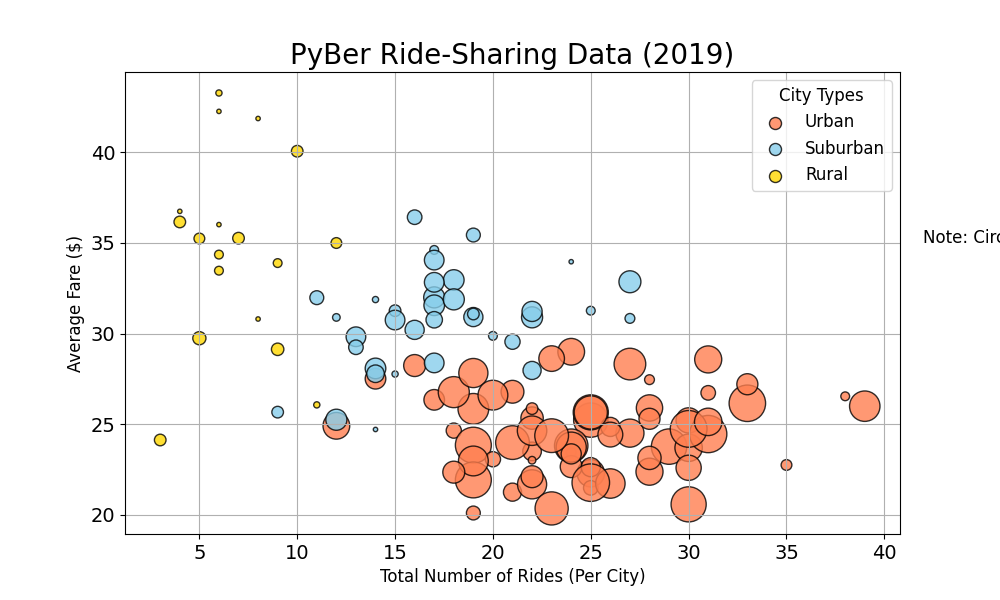
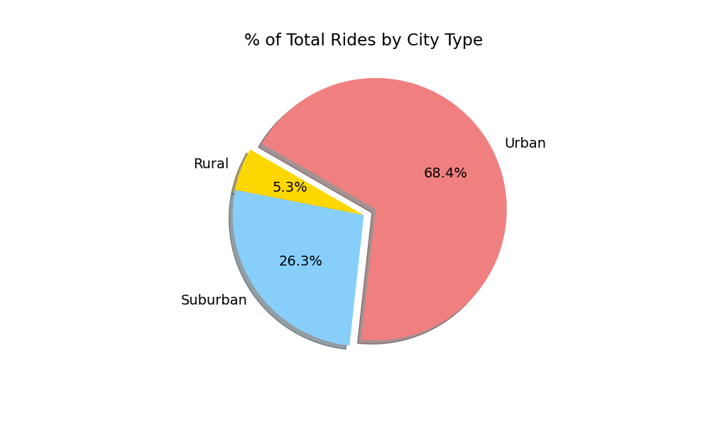

# Ride Sharing Analysis

## Project Overview
The goal of this analysis was to organize two sets of unstructured data into a visualization based on ride-sharing data across three city types. The result is a multiple-line graph showing total weekly fares for each city type which may inform business decisions at ride-sharing company "PyBer."

#### Resources 
Data sets included:

- ``` ride_data.csv``` 
    * unprocessed data on city, date, fare and ride ID.
- ```city_data.csv``` 
    * unprocessed data on city, driver count and city type. 

Software used:
* Jupyter Notebook with python, pandas and matplotlib libraries

## Analysis

After merging the data sets by the city column, I was able to perform a number of analyses:

```pyber_data_df = pd.merge(ride_data_df, city_data_df, how="left", on=["city", "city"])```


Here we can see the differences in ride-sharing data by city:




Over the course of the 4-month data ingestion period, PyBer provided 2,375 rides:
- Urban rides: 68.4% 
- Suburban rides: 26.3% 
- Rural rides: 5.3% 

Notably, rural drivers account for less than 3% of total drivers, and only about 5% of the ride share:



This is likely because of a lower market share and increased ride distances in rural areas, reflected in the higher average fare per drive:


## Summary
To summarize, this data may inform future growth opportunities at PyBer. The following points were noted for decision-makers:

1. Since the the total fares in the rural zones are low (about 7% of fare revenue), the company may do well to shift its focus to suburban and urban opportunities. 
2. There are clear spikes in certain dates across the board. Mid- to late February stands out -- perhaps because of Valentine's Day. April 1st appears to be another 'hot zone' for a surge in ride-shares. By calculating fare costs within these date ranges, there may be great potential to increase revenue; conversely, there may be opportunities to bolster rides outside of these suring date ranges. 
3. Finally, I recommend an additional date-specific analysis: instead of looking at a four-month window, we might look at any given range of weekdays vs. weekends, perhaps comparing all 52 weekends in the year. By using this analysis and applying the principles in the second recommendation above, PyBer has yet another opportunity to increase business. 

